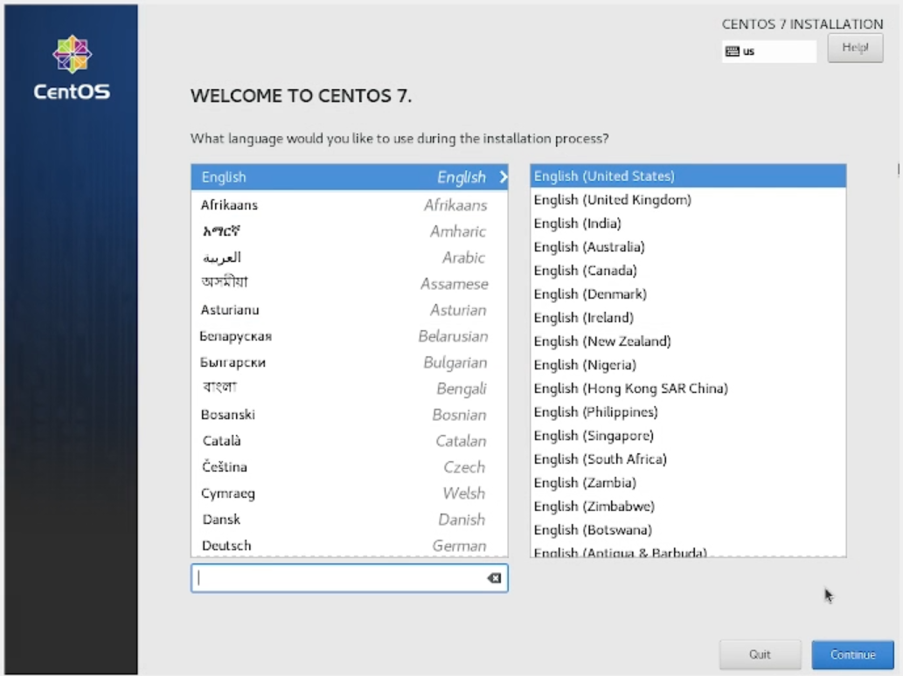
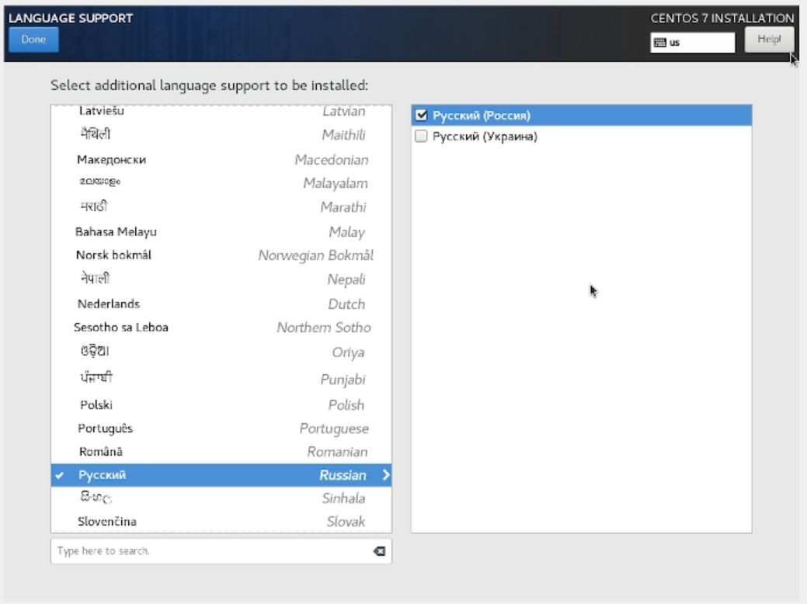

---
# Front matter
title: "Отчёт по лабораторной работе №1"
subtitle: "Установка и конфигурация операционной системы на виртуальную машину"
author: "Аминов Зулфикор Мирзокаримович"

# Generic otions
lang: ru-RU
toc-title: "Содержание"

# Bibliography
bibliography: bib/cite.bib
csl: pandoc/csl/gost-r-7-0-5-2008-numeric.csl

# Pdf output format
toc: true # Table of contents
toc_depth: 2
fontsize: 12pt
linestretch: 1.5
papersize: a4
documentclass: scrreprt
## I18n
polyglossia-lang:
  name: russian
  options:
	- spelling=modern
	- babelshorthands=true
polyglossia-otherlangs:
  name: english
### Fonts
mainfont: PT Serif
romanfont: PT Serif
sansfont: PT Sans
monofont: PT Mono
mainfontoptions: Ligatures=TeX
romanfontoptions: Ligatures=TeX
sansfontoptions: Ligatures=TeX,Scale=MatchLowercase
monofontoptions: Scale=MatchLowercase,Scale=0.9
## Biblatex
biblatex: true
biblio-style: "gost-numeric"
biblatexoptions:
  - parentracker=true
  - backend=biber
  - hyperref=auto
  - language=auto
  - autolang=other*
  - citestyle=gost-numeric
## Misc options
indent: true
header-includes:
  - \linepenalty=10 # the penalty added to the badness of each line within a paragraph (no associated penalty node) Increasing the value makes tex try to have fewer lines in the paragraph.
  - \interlinepenalty=0 # value of the penalty (node) added after each line of a paragraph.
  - \hyphenpenalty=50 # the penalty for line breaking at an automatically inserted hyphen
  - \exhyphenpenalty=50 # the penalty for line breaking at an explicit hyphen
  - \binoppenalty=700 # the penalty for breaking a line at a binary operator
  - \relpenalty=500 # the penalty for breaking a line at a relation
  - \clubpenalty=150 # extra penalty for breaking after first line of a paragraph
  - \widowpenalty=150 # extra penalty for breaking before last line of a paragraph
  - \displaywidowpenalty=50 # extra penalty for breaking before last line before a display math
  - \brokenpenalty=100 # extra penalty for page breaking after a hyphenated line
  - \predisplaypenalty=10000 # penalty for breaking before a display
  - \postdisplaypenalty=0 # penalty for breaking after a display
  - \floatingpenalty = 20000 # penalty for splitting an insertion (can only be split footnote in standard LaTeX)
  - \raggedbottom # or \flushbottom
  - \usepackage{float} # keep figures where there are in the text
  - \floatplacement{figure}{H} # keep figures where there are in the text
---

# Цель работы

Целью данной работы является приобретение практических навыков
установки операционной системы на виртуальную машину, настройки
минимально необходимых для дальнейшей работы сервисов.

# Выполнение работы

## Имя машины и тип ОС

{ #fig:001 width=100% height=100% }

## Размер основной памяти

{ #fig:002 width=100% height=100% }

## Создания жёсткого диска на виртуальной машине

{ #fig:003 width=100% height=100% }

## Тип подключение виртуального жёсткого диска

{ #fig:004 width=100% height=100% }

## Окно определения формата виртуального жёсткого диска

{ #fig:005 width=100% height=100% }

## Окно определения размера виртуального динамического жёсткого диска и его расположения

{ #fig:006 width=100% height=100% }

## Окно «Носители» виртуальной машины: подключение образа оптического диска

{ #fig:007 width=100% height=100% }

## Установка английского языка интерфейса ОС

{ #fig:008 width=100% height=100% }

## Установка часового пояса

{ #fig:009 width=100% height=100% }

## Добаваление клавиатура

{ #fig:01 width=100% height=100% }

## Настройка язык

{ #fig:011 width=100% height=100% }

## Окно настройки установки: выбор программ

{ #fig:012 width=100% height=100% }

## Окно настройки установки: место установки

{ #fig:013 width=100% height=100% }

## Окно настройки установки: отключение KDUMP

{ #fig:014 width=100% height=100% }

## Окно настройки установки: сеть и имя узла

{ #fig:015 width=100% height=100% }

## Установка пароля для пользователя с правами администратора

{ #fig:016 width=100% height=100% }

## Первоначальная настройка ОС: переход к лицензии

{ #fig:017 width=100% height=100% }

## Установка драйверов

{ #fig:018 width=100% height=100% }

## Домашнее задание

{ #fig:019 width=100% height=100% }

## Поиск версия ядра Linux

{ #fig:02 width=100% height=100% }

# Выводы

Научили установить ОС на ВМ.
